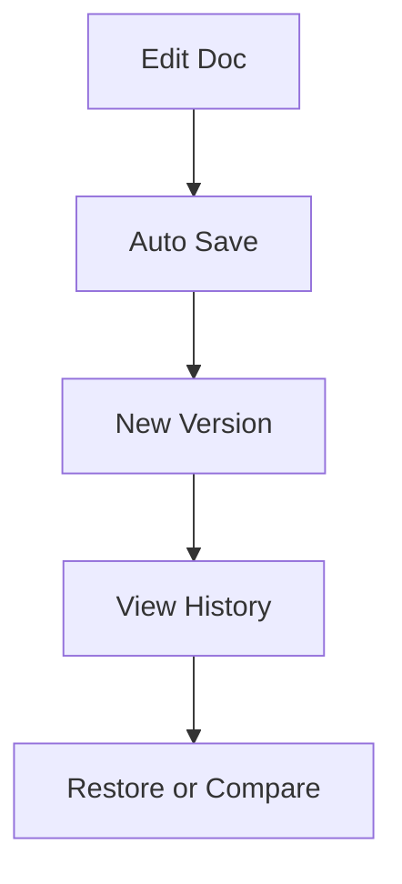

## Overview

George provides powerful tools to streamline your documentation workflow. You organize documents into intuitive folder structures, collaborate seamlessly with your team, search efficiently across content, and maintain version history for all changes. These features ensure your project documentation stays current and accessible.

<Columns cols={2}>
  <Card title="Organize with Folders" icon="folder" href="#document-organization">
    Structure your docs hierarchically for easy navigation.
  </Card>
  <Card title="Collaborate Effectively" icon="users" href="#collaboration">
    Invite team members and manage permissions.
  </Card>
  <Card title="Powerful Search" icon="search" href="#search">
    Find content quickly with advanced filters.
  </Card>
  <Card title="Version Control" icon="git-branch" href="#version-control">
    Track changes and revert when needed.
  </Card>
</Columns>

## Document Organization and Folders

Create a clear hierarchy to manage your documentation. You start by setting up top-level folders for major categories like "API Reference" or "User Guides". Nest subfolders for deeper organization, such as "API Reference > Endpoints > Users".

<Steps>
  <Step title="Create a Folder" icon="plus">
    Navigate to your project dashboard.
    
    Click the `New Folder` button in the sidebar.
    
````bash
# Example folder structure you'll see
docs/
├── api/
│   └── endpoints/
├── guides/
│   └── onboarding/
└── changelog.mdx
````
  </Step>
  <Step title="Move Documents" icon="move">
    Drag and drop files between folders.
    
    Use the `Move to` option in the document menu for bulk actions.
  </Step>
  <Step title="Rename and Delete" icon="edit-3">
    Right-click folders to rename or archive them safely.
  </Step>
</Steps>

<Callout kind="tip">
  Use consistent naming conventions like `kebab-case` for folders to improve searchability.
</Callout>

## Project Collaboration Tools

Invite teammates to collaborate in real-time. Assign roles such as Viewer, Editor, or Admin to control access. Share specific folders or documents via public links with expiration dates.

<Tabs>
  <Tab title="Invite Users" icon="user-plus">
    From the project settings, enter email addresses.
    
    ```javascript
    // Example invite API call (if using George's API)
    await fetch('https://api.example.com/projects/123/invites', {
      method: 'POST',
      headers: { 'Authorization': 'Bearer YOUR_TOKEN' },
      body: JSON.stringify({
        emails: ['team@company.com'],
        role: 'editor'
      })
    });
    ```
  </Tab>
  <Tab title="Share Links" icon="share-2">
    Generate shareable links with permissions.
    
    Set viewer limits or passwords for sensitive docs.
  </Tab>
  <Tab title="Real-time Edits" icon="edit">
    Multiple users edit simultaneously with live cursors and change notifications.
  </Tab>
</Tabs>

## Search and Filtering Options

Locate any document instantly with George's full-text search. Filter by folder, tag, author, or last modified date. Advanced options include boolean searches like `API AND authentication`.

| Filter Type | Description | Example |
|-------------|-------------|---------|
| Keyword | Matches titles and content | `oauth flow` |
| Folder | Scope to specific paths | `in:api/endpoints` |
| Tags | Filter by custom labels | `tag:security` |
| Date | Recent changes | `modified:>2024-01-01` |

<Callout kind="info">
  Pro tip: Use quotes for exact phrases, e.g., `"user authentication"`.
</Callout>

## Version Control for Docs

George tracks every change automatically, allowing you to view diffs, restore previous versions, or compare branches. This integrates with Git for advanced users.

<CodeGroup tabs="Markdown,Diff">
  ```markdown
  # Before Edit
  ## Authentication
  
  Use `{API_KEY}` for basic auth.
  ```
  ```diff
  # Version Diff View
  ## Authentication
  + Use `{API_KEY}` for basic auth.
  - Use basic auth only.
  ```
</CodeGroup>



<Expandable title="Advanced Git Integration" default-open="false">
  Connect your repo to sync changes bidirectionally.
  
  ```bash
  git remote add george https://git.example.com/project.git
  git push george main
  ```
</Expandable>

## Next Steps

Explore these features hands-on in your project. Start by organizing your current docs into folders, then invite your team.

<Card title="Quickstart Guide" icon="book-open" href="/quickstart">
  Set up your first project.
</Card>

<Card title="API Reference" icon="code" href="/authentication">
  Integrate programmatically.
</Card>